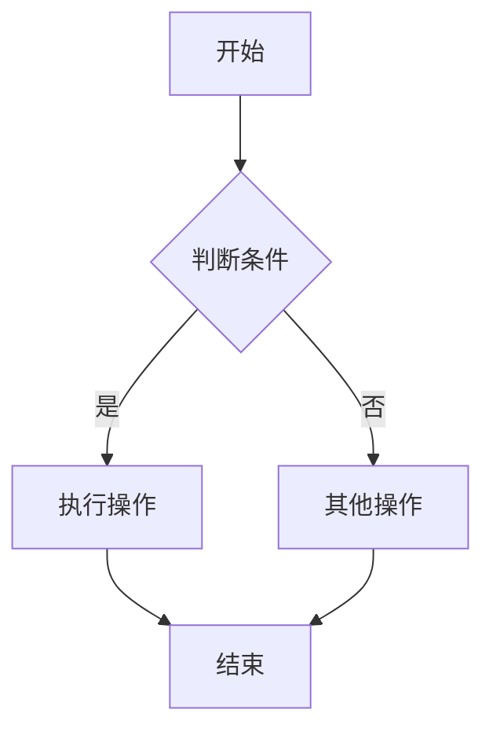
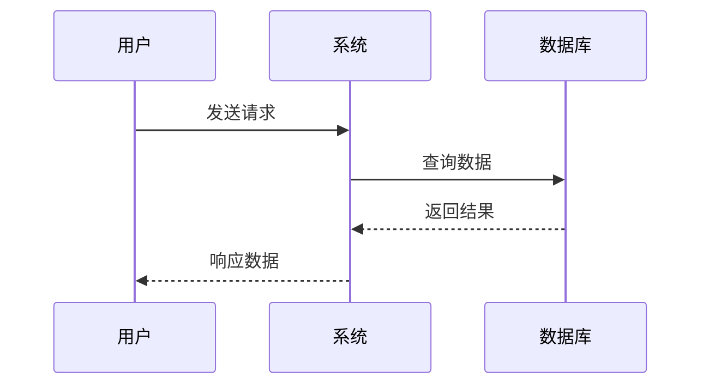
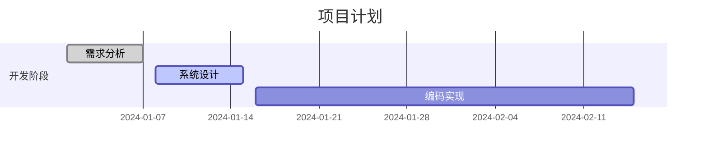
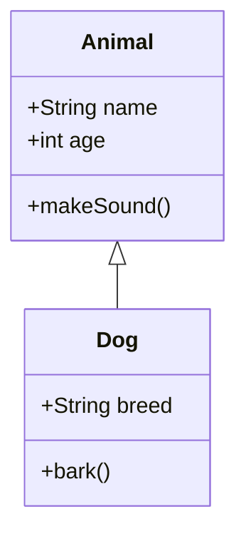

# Mermaid 图

用于渲染 Mermaid 图表，支持流程图、时序图、甘特图、类图等多种图表类型。基于 Mermaid 库实现，提供美观的图表渲染和交互功能。

## 代码演示

<code src="../demos/charts/mermaid.tsx" background="var(--main-bg-color)" iframe=540></code>

## API

### Mermaid

Mermaid 图表渲染组件，支持各种 Mermaid 图表类型。

| 参数 | 说明 | 类型 | 默认值 |
| --- | --- | --- | --- |
| el | 代码节点，包含 Mermaid 图表代码 | `CodeNode` | - |
| el.value | Mermaid 图表代码字符串 | `string` | - |
| el.language | 图表语言类型，通常为 'mermaid' | `string` | 'mermaid' |
| el.type | 节点类型，通常为 'code' | `string` | 'code' |

### CodeNode

```typescript
interface CodeNode {
  type: 'code';
  language?: string;
  value?: string;
  frontmatter?: boolean;
}
```

## 支持的图表类型

### 1. 流程图 (Flowchart)


### 2. 时序图 (Sequence Diagram)


### 3. 甘特图 (Gantt Chart)


### 4. 类图 (Class Diagram)


## 功能特性

- **多种图表类型**：支持流程图、时序图、甘特图、类图、状态图等
- **错误处理**：自动检测和显示 Mermaid 语法错误
- **延迟渲染**：优化性能，避免频繁重渲染
- **响应式设计**：自适应不同屏幕尺寸
- **美观样式**：提供现代化的图表样式
- **空状态处理**：优雅处理空内容状态
- **唯一标识**：自动生成唯一 ID 避免冲突

## 说明

- **移动端适配**：移动端自动启用响应式布局，宽度 100%，高度不超过 400px
- **性能优化**：使用延迟渲染机制，避免频繁重绘
- **错误提示**：当 Mermaid 语法错误时，会显示友好的错误信息
- **样式定制**：支持通过 CSS 变量自定义图表样式
- **交互功能**：支持图表缩放、拖拽等交互操作