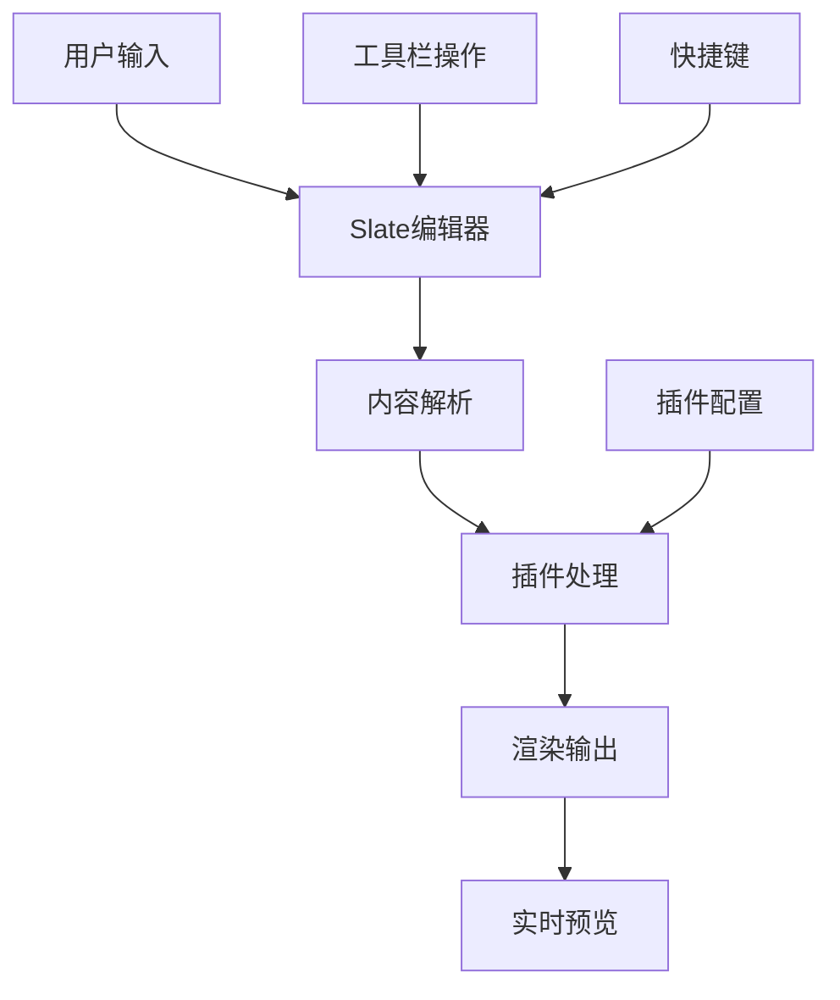
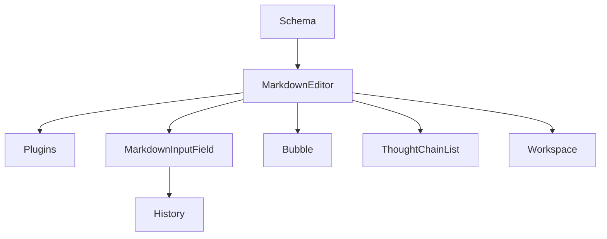

---
nav:
  title: 项目研发
  order: 1
group:
  title: 开发指南
  order: 5
---

# 项目技术栈与架构说明

> **项目简介**：`md-editor` 是一个基于 React + TypeScript 的现代化 Markdown 编辑器，提供丰富的编辑功能和插件系统，支持实时预览、语法高亮、数学公式渲染等特性。

<!--
  项目概述：
  - 这是一个功能完整的Markdown编辑器
  - 采用现代化的技术栈和架构设计
  - 支持插件化扩展和自定义功能
  - 提供良好的开发体验和用户界面
-->

## 目录

- [技术栈概览](#技术栈概览)
- [项目架构](#项目架构)
- [文件夹结构](#文件夹结构)
- [核心模块说明](#核心模块说明)
- [开发环境配置](#开发环境配置)
- [构建与部署](#构建与部署)

## 技术栈概览

<!--
  技术栈说明：
  - 前端框架：React 18 + TypeScript
  - 编辑器核心：Slate.js
  - UI组件库：Ant Design
  - 样式方案：CSS-in-JS
  - 构建工具：Vite
  - 测试框架：Jest + Testing Library
-->

### 核心技术

| 技术           | 版本  | 用途       | 说明                                       |
| -------------- | ----- | ---------- | ------------------------------------------ |
| **React**      | 18.x  | 前端框架   | 使用最新的React特性，包括Hooks、Suspense等 |
| **TypeScript** | 5.x   | 类型系统   | 提供完整的类型安全，提高代码质量           |
| **Slate.js**   | 0.94+ | 编辑器核心 | 可定制的富文本编辑器框架                   |
| **Ant Design** | 5.x   | UI组件库   | 企业级UI设计语言和React组件库              |

### 开发工具

| 工具                | 版本 | 用途       | 说明                              |
| ------------------- | ---- | ---------- | --------------------------------- |
| **Vite**            | 4.x  | 构建工具   | 快速的开发服务器和构建工具        |
| **Jest**            | 29.x | 测试框架   | JavaScript测试框架                |
| **Testing Library** | 13.x | 测试工具   | React组件测试工具                 |
| **ESLint**          | 8.x  | 代码检查   | JavaScript/TypeScript代码质量检查 |
| **Prettier**        | 2.x  | 代码格式化 | 代码格式化工具                    |

### 插件生态

| 插件          | 用途         | 说明                         |
| ------------- | ------------ | ---------------------------- |
| **KaTeX**     | 数学公式渲染 | 支持LaTeX数学公式的实时渲染  |
| **Mermaid**   | 图表渲染     | 支持流程图、时序图等图表渲染 |
| **Reveal.js** | 幻灯片       | 支持Markdown转幻灯片演示     |
| **Chart.js**  | 图表组件     | 支持各种数据图表的渲染       |

## 项目架构

<!--
  架构设计说明：
  - 采用模块化架构设计
  - 核心编辑器与插件分离
  - 支持组件化开发
  - 提供完整的类型定义
-->

### 整体架构

```
md-editor/
├── 核心编辑器 (Slate.js)
│   ├── 基础编辑器组件
│   ├── 工具栏和菜单
│   └── 快捷键系统
├── 插件系统
│   ├── 数学公式插件 (KaTeX)
│   ├── 图表插件 (Mermaid)
│   ├── 幻灯片插件 (Reveal.js)
│   └── 自定义插件接口
├── UI组件库
│   ├── 基础组件
│   ├── 业务组件
│   └── 图标系统
└── 工具和配置
    ├── 构建配置
    ├── 测试配置
    └── 开发工具
```

### 数据流架构



## 文件夹结构

<!--
  文件夹结构说明：
  - 按功能模块组织代码
  - 清晰的层次结构
  - 便于维护和扩展
  - 遵循最佳实践
-->

### 根目录结构

```
md-editor/
├── src/                    # 源代码目录
│   ├── components/         # 全局组件
│   ├── MarkdownEditor/     # 核心编辑器模块
│   ├── MarkdownInputField/ # 输入字段模块
│   ├── History/           # 历史记录模块
│   ├── Bubble/            # 气泡组件模块
│   ├── ThoughtChainList/  # 思维链列表模块
│   ├── Workspace/         # 工作空间模块
│   ├── plugins/           # 插件系统
│   ├── schema/            # 模式定义
│   ├── icons/             # 图标系统
│   ├── hooks/             # 自定义Hooks
│   ├── utils/             # 工具函数
│   └── types/             # 类型定义
├── docs/                  # 文档目录
│   ├── components/        # 组件文档
│   ├── demos/            # 演示文件
│   └── plugin/           # 插件文档
├── tests/                 # 测试文件
├── scripts/               # 构建脚本
├── package.json           # 项目配置
├── vite.config.ts         # Vite配置
├── tsconfig.json          # TypeScript配置
└── README.md              # 项目说明
```

### 核心模块详解

#### 1. MarkdownEditor 模块

MarkdownEditor 是整个项目的核心模块，基于 Slate.js 构建，提供了强大而灵活的 Markdown 编辑功能。

**技术特点：**

- **基于 Slate.js**: 利用 Slate.js 的可扩展架构，提供丰富的编辑能力
- **插件化设计**: 通过插件系统支持功能扩展，如数学公式、图表等
- **完整类型定义**: 基于 TypeScript，提供完整的类型安全保障
- **高性能渲染**: 优化的渲染机制，支持大文档编辑

```
src/MarkdownEditor/
├── BaseMarkdownEditor.tsx    # 基础编辑器组件
├── editor/                   # 编辑器核心
│   ├── Editor.tsx           # 主编辑器组件
│   ├── components/          # 编辑器组件
│   │   ├── Editable.tsx     # 可编辑区域
│   │   ├── Toolbar.tsx      # 工具栏组件
│   │   └── FloatBar.tsx     # 浮动工具栏
│   ├── elements/            # 元素渲染器
│   │   ├── Paragraph.tsx    # 段落元素
│   │   ├── Heading.tsx      # 标题元素
│   │   ├── List.tsx         # 列表元素
│   │   └── Table.tsx        # 表格元素
│   ├── plugins/             # 编辑器插件
│   │   ├── withMarkdown.ts  # Markdown 插件
│   │   ├── withShortcuts.ts # 快捷键插件
│   │   └── withHistory.ts   # 历史记录插件
│   ├── tools/               # 工具栏
│   │   ├── BoldTool.tsx     # 加粗工具
│   │   ├── ItalicTool.tsx   # 斜体工具
│   │   └── LinkTool.tsx     # 链接工具
│   └── utils/               # 编辑器工具
│       ├── serialize.ts     # 序列化工具
│       ├── deserialize.ts   # 反序列化工具
│       └── transforms.ts    # 变换操作
├── hooks/                   # 编辑器Hooks
│   ├── useEditor.ts         # 编辑器核心Hook
│   ├── useSelection.ts      # 选择状态Hook
│   └── useCommands.ts       # 命令系统Hook
├── utils/                   # 编辑器工具
│   ├── markdown.ts          # Markdown 解析
│   ├── hotkeys.ts          # 热键处理
│   └── clipboard.ts        # 剪贴板处理
└── index.ts                 # 模块导出
```

**主要功能：**

- **富文本编辑**: 支持完整的 Markdown 语法编辑
- **实时预览**: 提供所见即所得的编辑体验
- **语法高亮**: 多语言代码块语法高亮
- **快捷键支持**: 完整的键盘快捷键系统
- **插件系统**: 可扩展的插件架构
- **协作编辑**: 支持多人协作编辑功能

#### 2. MarkdownInputField 模块

MarkdownInputField 提供了一个功能丰富的输入组件，专门为快速输入和处理 Markdown 内容而设计。

**技术特点：**

- **轻量级输入**: 相比完整编辑器，提供更轻量的输入体验
- **附件处理**: 完整的文件上传和预览功能
- **智能建议**: 基于上下文的内容建议和自动补全
- **快速发送**: 支持快捷键发送和内容验证

```
src/MarkdownInputField/
├── MarkdownInputField.tsx    # 主输入组件
├── AttachmentButton/         # 附件按钮
│   ├── index.tsx            # 附件按钮主组件
│   ├── FileUploader.tsx     # 文件上传器
│   └── FilePreview.tsx      # 文件预览
├── FileMapView/             # 文件映射视图
│   ├── index.tsx            # 文件视图主组件
│   ├── FileItem.tsx         # 文件项组件
│   └── FileActions.tsx      # 文件操作
├── SendButton/              # 发送按钮
│   ├── index.tsx            # 发送按钮主组件
│   └── SendStatus.tsx       # 发送状态
├── Suggestion/              # 建议功能
│   ├── index.tsx            # 建议主组件
│   ├── SuggestionList.tsx   # 建议列表
│   └── SuggestionItem.tsx   # 建议项
└── style.ts                 # 样式文件
```

**主要功能：**

- **Markdown 输入**: 支持基础 Markdown 语法输入
- **附件上传**: 拖拽上传、粘贴上传等多种方式
- **文件预览**: 支持图片、视频、文档等多种格式预览
- **智能建议**: 自动补全、模板建议、历史记录建议
- **发送功能**: 快捷键发送、内容验证、发送状态提示

#### 3. History 模块

History 模块负责管理用户的编辑历史和会话记录，提供强大的历史管理功能。

**技术特点：**

- **高效存储**: 使用 IndexedDB 进行本地存储，支持大量历史记录
- **智能搜索**: 全文搜索、标签过滤、时间范围筛选
- **收藏管理**: 重要内容收藏和分类管理
- **批量操作**: 支持批量删除、导出、分享等操作

```
src/History/
├── components/              # 历史组件
│   ├── HistoryItem.tsx     # 历史项组件
│   ├── HistoryActionsBox.tsx # 操作按钮
│   ├── NewChatComponent.tsx # 新对话组件
│   ├── SearchComponent.tsx  # 搜索组件
│   └── LoadMoreComponent.tsx # 加载更多
├── hooks/                   # 历史Hooks
├── types/                   # 类型定义
├── utils/                   # 工具函数
├── icons/                   # 图标
└── index.tsx                # 主组件
```

**主要功能：**

- 历史记录管理
- 搜索和过滤
- 收藏功能
- 批量操作
- 分页加载

#### 4. Bubble 模块

<!--
  气泡模块说明：
  - 提供气泡式UI组件
  - 支持消息展示
  - 提供文件预览
  - 支持复制功能
-->

```
src/Bubble/
├── Avatar/                  # 头像组件
├── FileView/               # 文件视图
├── List/                   # 列表组件
├── MessagesContent/        # 消息内容
├── BubbleConfigProvide.tsx # 配置提供者
└── style.ts                # 样式文件
```

**主要功能：**

- 消息气泡
- 文件预览
- 头像显示
- 列表展示
- 配置管理

#### 5. ThoughtChainList 模块

<!--
  思维链模块说明：
  - 展示思维过程
  - 支持动画效果
  - 提供工具调用展示
  - 支持深度思考展示
-->

```
src/ThoughtChainList/
├── Collapse.tsx            # 折叠组件
├── CostMillis.tsx          # 成本显示
├── DeepThink.tsx           # 深度思考
├── DotAni/                 # 点动画
├── FlipText/               # 翻转文本
├── ToolCall/               # 工具调用
└── style.ts                # 样式文件
```

**主要功能：**

- 思维链展示
- 动画效果
- 工具调用
- 成本统计
- 深度思考

#### 6. Workspace 模块

<!--
  工作空间模块说明：
  - 提供工作空间功能
  - 支持文件管理
  - 提供浏览器功能
  - 支持任务管理
-->

```
src/Workspace/
├── Browser/                # 浏览器组件
├── File/                   # 文件管理
├── HtmlPreview/            # HTML预览
├── RealtimeFollow/         # 实时跟随
├── Task/                   # 任务管理
├── icons/                  # 图标
├── utils/                  # 工具函数
└── index.tsx               # 主组件
```

**主要功能：**

- 文件管理
- 浏览器功能
- HTML预览
- 实时跟随
- 任务管理

#### 7. Plugins 模块

<!--
  插件模块说明：
  - 提供插件化架构
  - 支持数学公式
  - 支持图表渲染
  - 支持幻灯片
-->

```
src/Plugins/
├── chart/                  # 图表插件
│   ├── ChartAttrToolBar/   # 图表工具栏
│   ├── ChartMark/          # 图表标记
│   └── ChartRender.tsx     # 图表渲染
├── code/                   # 代码插件
│   ├── components/         # 代码组件
│   ├── hooks/              # 代码Hooks
│   └── langIcons/          # 语言图标
├── katex/                  # 数学公式插件
├── mermaid/                # 图表插件
└── defaultPlugins.tsx      # 默认插件
```

**主要功能：**

- 数学公式渲染
- 图表渲染
- 代码高亮
- 幻灯片支持
- 插件管理

#### 8. Schema 模块

<!--
  模式模块说明：
  - 提供JSON Schema支持
  - 动态表单生成
  - 内容渲染
  - 模板引擎
-->

```
src/schema/
├── SchemaForm/             # 模式表单
├── SchemaRenderer/         # 模式渲染器
├── schema.definition.json  # 模式定义
├── schema.json            # 模式配置
└── index.ts               # 模块导出
```

**主要功能：**

- JSON Schema支持
- 动态表单
- 内容渲染
- 模板引擎
- 数据验证

## 核心模块说明

<!--
  核心模块说明：
  - 每个模块都有明确的职责
  - 模块间通过接口通信
  - 支持独立开发和测试
  - 提供完整的类型定义
-->

### 模块职责划分

| 模块                   | 主要职责   | 核心功能             | 依赖关系           |
| ---------------------- | ---------- | -------------------- | ------------------ |
| **MarkdownEditor**     | 编辑器核心 | 富文本编辑、实时预览 | Slate.js, 插件系统 |
| **MarkdownInputField** | 输入处理   | 文本输入、附件上传   | 编辑器核心         |
| **History**            | 历史管理   | 记录管理、搜索过滤   | 数据存储           |
| **Bubble**             | UI展示     | 消息展示、文件预览   | UI组件库           |
| **ThoughtChainList**   | 思维展示   | 过程展示、动画效果   | 动画库             |
| **Workspace**          | 工作空间   | 文件管理、任务管理   | 文件系统           |
| **Plugins**            | 功能扩展   | 插件管理、功能扩展   | 编辑器核心         |
| **Schema**             | 数据模式   | 表单生成、内容渲染   | JSON Schema        |

### 模块通信机制



## 开发环境配置

<!--
  开发环境说明：
  - 提供完整的开发环境
  - 支持热重载和调试
  - 包含代码质量工具
  - 提供测试环境
-->

### 环境要求

- **Node.js**: 16.x 或更高版本
- **npm**: 8.x 或更高版本
- **Git**: 2.x 或更高版本

### 安装依赖

```bash
# 安装项目依赖
npm install

# 安装开发依赖
npm install --save-dev
```

### 开发命令

```bash
# 启动开发服务器
npm run dev

# 构建生产版本
npm run build

# 运行测试
npm run test

# 代码检查
npm run lint

# 代码格式化
npm run format
```

### 开发工具配置

#### Vite 配置

```tsx | pure
// vite.config.ts
import { defineConfig } from 'vite';
import react from '@vitejs/plugin-react';

export default defineConfig({
  plugins: [react()],
  server: {
    port: 3000,
    open: true,
  },
  build: {
    outDir: 'dist',
    sourcemap: true,
  },
});
```

#### TypeScript 配置

```json
// tsconfig.json
{
  "compilerOptions": {
    "target": "ES2020",
    "lib": ["ES2020", "DOM", "DOM.Iterable"],
    "module": "ESNext",
    "skipLibCheck": true,
    "moduleResolution": "bundler",
    "allowImportingTsExtensions": true,
    "resolveJsonModule": true,
    "isolatedModules": true,
    "noEmit": true,
    "jsx": "react-jsx",
    "strict": true,
    "noUnusedLocals": true,
    "noUnusedParameters": true,
    "noFallthroughCasesInSwitch": true
  },
  "include": ["src"],
  "references": [{ "path": "./tsconfig.node.json" }]
}
```

## 构建与部署

<!--
  构建部署说明：
  - 提供多种构建模式
  - 支持环境配置
  - 包含性能优化
  - 提供部署指南
-->

### 构建模式

#### 开发构建

```bash
# 开发模式构建
npm run dev:build

# 特点：
# - 包含源码映射
# - 未压缩代码
# - 快速构建
# - 便于调试
```

#### 生产构建

```bash
# 生产模式构建
npm run build

# 特点：
# - 代码压缩
# - 资源优化
# - 性能优化
# - 体积优化
```

### 环境配置

#### 开发环境

```bash
# .env.development
VITE_APP_ENV=development
VITE_APP_API_URL=http://localhost:8080
VITE_APP_DEBUG=true
```

#### 生产环境

```bash
# .env.production
VITE_APP_ENV=production
VITE_APP_API_URL=https://api.example.com
VITE_APP_DEBUG=false
```

### 部署指南

#### 静态部署

```bash
# 构建生产版本
npm run build

# 部署到静态服务器
# 将 dist/ 目录内容部署到 Web 服务器
```

#### Docker 部署

```dockerfile
# Dockerfile
FROM node:16-alpine as builder
WORKDIR /app
COPY package*.json ./
RUN npm ci
COPY . .
RUN npm run build

FROM nginx:alpine
COPY --from=builder /app/dist /usr/share/nginx/html
EXPOSE 80
CMD ["nginx", "-g", "daemon off;"]
```

### 性能优化

#### 代码分割

```tsx | pure
// 动态导入组件
const MarkdownEditor = lazy(() => import('./MarkdownEditor'));
const History = lazy(() => import('./History'));
```

#### 资源优化

```tsx | pure
// 图片优化
import { optimizeImage } from './utils/image';

// 字体优化
import { preloadFonts } from './utils/fonts';
```

#### 缓存策略

```tsx | pure
// 服务工作者缓存
if ('serviceWorker' in navigator) {
  navigator.serviceWorker.register('/sw.js');
}
```

## 总结

<!--
  总结说明：
  - 项目采用现代化技术栈
  - 模块化架构设计
  - 完整的开发工具链
  - 良好的可维护性
-->

`md-editor` 项目采用现代化的技术栈和架构设计，具有以下特点：

### 技术优势

1. **现代化技术栈**：React 18 + TypeScript + Vite
2. **模块化架构**：清晰的模块划分和职责分离
3. **插件化设计**：支持功能扩展和自定义
4. **类型安全**：完整的 TypeScript 类型定义
5. **开发体验**：热重载、代码检查、测试覆盖

### 架构优势

1. **可维护性**：清晰的代码结构和模块划分
2. **可扩展性**：插件化架构支持功能扩展
3. **可测试性**：完整的测试体系和工具支持
4. **性能优化**：代码分割、资源优化、缓存策略

### 开发优势

1. **开发效率**：现代化的开发工具和流程
2. **代码质量**：ESLint、Prettier、TypeScript 保障
3. **团队协作**：统一的代码规范和开发流程
4. **文档完善**：详细的文档和示例代码

这个项目为团队提供了一个功能完整、架构清晰、易于维护的 Markdown 编辑器解决方案。
