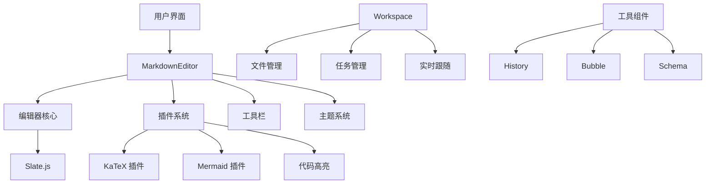

---
nav:
  title: 文档导航
  order: 0
---

# 📖 md-editor 文档导航

欢迎使用 md-editor 文档！本页面为您提供了完整的文档导航，帮助您快速找到所需的信息。

## 🚀 快速开始

如果您是第一次使用 md-editor，建议按以下顺序阅读文档：

1. [项目介绍](#项目介绍) - 了解项目概况和特性
2. [安装和使用](#安装和使用) - 快速上手使用
3. [API 文档](#api-文档) - 详细的组件 API 说明
4. [示例和演示](#示例和演示) - 丰富的使用示例

## 📚 文档结构

### 项目介绍

| 文档 | 描述 | 适合人群 |
|------|------|----------|
| [README.md](../README.md) | 项目概述、特性介绍、快速开始 | 所有用户 |
| [主页](./index.md) | 功能亮点、特性展示、快速示例 | 所有用户 |

### 安装和使用

| 文档 | 描述 | 适合人群 |
|------|------|----------|
| [快速开始](/components/markdown-editor) | 基础安装、配置、使用方法 | 初学者 |
| [API 文档](/components/api) | 完整的组件 API 和属性说明 | 开发者 |

### 组件文档

| 组件 | 文档链接 | 描述 |
|------|----------|------|
| **MarkdownEditor** | [API 文档](/components/api) | 核心编辑器组件 |
| **Workspace** | [工作空间](/components/workspace) | 多标签页工作环境 |
| **History** | [历史记录](/components/history) | 编辑历史管理 |
| **Bubble** | [气泡组件](/components/bubble) | 消息气泡展示 |
| **ThoughtChainList** | [思维链](/components/ThoughtChainList) | 思维过程展示 |
| **Schema** | [模式组件](/components/schema) | JSON Schema 表单 |

### 工具和功能

| 功能 | 文档链接 | 描述 |
|------|----------|------|
| **MarkdownInputField** | [输入组件](/components/markdownInputField) | Markdown 输入框 |
| **TaskList** | [任务列表](/components/task-list) | 任务管理组件 |
| **Loading** | [加载状态](/components/loading) | 加载动画组件 |
| **TaskRunning** | [任务运行](/components/task-running) | 任务执行状态 |
| **ToolUseBar** | [工具栏](/components/tool-use-bar) | 工具使用栏 |

### 工具函数

| 工具 | 文档链接 | 描述 |
|------|----------|------|
| **工具函数集合** | [工具函数](/utils/) | 各种实用工具函数 |
| **Markdown 转换** | [markdownToHtml](/utils/markdownToHtml) | Markdown 到 HTML 转换 |
| **HTML 转换** | [html-to-markdown](/utils/html-to-markdown-utils) | HTML 到 Markdown 转换 |
| **编辑器工具** | [editorUtils](/utils/editorUtils) | 编辑器相关工具 |
| **DOM 操作** | [DOM 工具](/utils/dom) | DOM 操作工具 |
| **图表配置** | [chart-config](/utils/chart-config) | 图表配置工具 |
| **Markdown 检测** | [isMarkdown](/utils/isMarkdown) | Markdown 格式检测 |

### 插件系统

| 插件 | 文档链接 | 描述 |
|------|----------|------|
| **插件开发** | [插件指南](/plugin/) | 插件开发指南和示例 |
| **插件演示** | [插件演示](/plugin/demo) | 各种插件的使用演示 |

## 🛠️ 开发文档

### 项目开发

| 文档 | 描述 | 适合人群 |
|------|------|----------|
| [项目架构](/development/project-overview) | 技术栈、架构设计、模块说明 | 开发者 |
| [开发指南](/development/development-guide) | 开发流程、最佳实践、调试技巧 | 贡献者 |
| [CSS-in-JS 指南](/development/css-in-js-guide) | 样式开发指南和最佳实践 | 前端开发者 |
| [组件开发](/development/component-development-guide) | 组件开发规范和指南 | 组件开发者 |

### 架构设计



## 📱 示例和演示

### 在线演示

| 演示 | 链接 | 描述 |
|------|------|------|
| **基础编辑器** | [演示页面](/demos-pages/editor) | 基础编辑功能展示 |
| **内容类型** | [内容类型](/demos-pages/content-types) | 各种内容类型支持 |
| **工作空间** | [工作空间演示](/demos-pages/workspace) | 工作空间功能演示 |
| **视频功能** | [视频演示](/demos-pages/video) | 视频相关功能 |

### 代码示例

#### 基础使用

```tsx
import { MarkdownEditor } from '@ant-design/md-editor';

// 最简单的使用方式
<MarkdownEditor />

// 带初始内容的编辑器
<MarkdownEditor initValue="# Hello World" />
```

#### 高级配置

```tsx
import { MarkdownEditor } from '@ant-design/md-editor';

// 完整配置示例
<MarkdownEditor
  height={600}
  initValue="# 高级配置示例"
  toolBar={{
    enable: true,
    extra: [<CustomButton key="custom" />]
  }}
  image={{
    upload: handleImageUpload
  }}
  onChange={(value, schema) => {
    console.log('内容变化:', value);
  }}
/>
```

## 🔍 搜索和查找

### 快速查找

- **查找组件**: 使用 `Ctrl+F` 搜索组件名称
- **查找功能**: 搜索相关关键词，如 "图片上传"、"代码高亮" 等
- **查找 API**: 在 [API 文档](/components/api) 中搜索属性名

### 常用关键词

| 功能 | 关键词 | 相关文档 |
|------|--------|----------|
| 图片处理 | `image`, `upload`, `图片` | [API 文档 - 图片配置](/components/api#图片配置-image) |
| 工具栏 | `toolbar`, `tools`, `工具栏` | [API 文档 - 工具栏配置](/components/api#工具栏配置-toolbar) |
| 主题定制 | `theme`, `style`, `主题` | [CSS-in-JS 指南](/development/css-in-js-guide) |
| 插件开发 | `plugin`, `extend`, `插件` | [插件开发指南](/plugin/) |
| 性能优化 | `performance`, `优化` | [开发指南 - 性能优化](/development/development-guide#性能优化) |

## 🤝 社区和支持

### 获取帮助

1. **文档搜索**: 首先在文档中搜索相关内容
2. **GitHub Issues**: [提交问题](https://github.com/ant-design/md-editor/issues)
3. **GitHub Discussions**: [参与讨论](https://github.com/ant-design/md-editor/discussions)
4. **示例代码**: 查看 [demos](./demos) 目录中的示例

### 贡献文档

文档改进同样重要！如果您发现：
- 文档有错误或过时信息
- 缺少某些功能的说明
- 示例代码可以改进
- 需要添加更多使用场景

欢迎提交 Pull Request 或 Issue 来帮助改进文档。

### 反馈渠道

- **文档问题**: [GitHub Issues](https://github.com/ant-design/md-editor/issues) 标记 `documentation`
- **功能建议**: [GitHub Discussions](https://github.com/ant-design/md-editor/discussions) 
- **Bug 报告**: [GitHub Issues](https://github.com/ant-design/md-editor/issues) 标记 `bug`

---

希望这个导航页面能帮助您更好地使用 md-editor。如果有任何建议或问题，欢迎与我们联系！